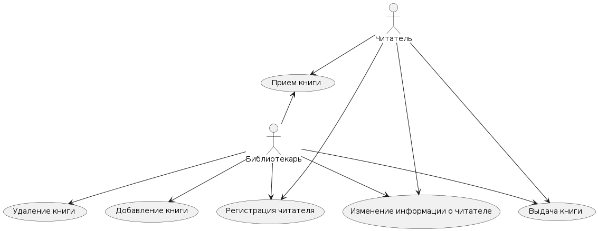
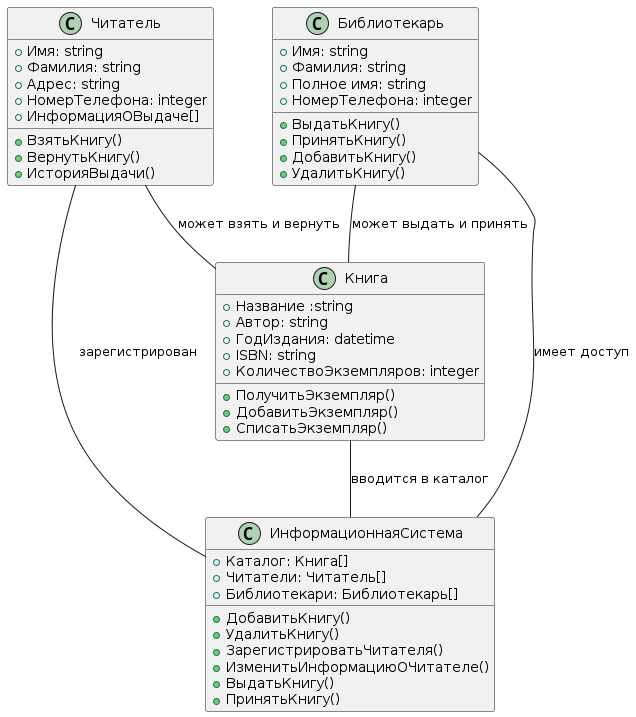

# Практическая работа №1
## Модельно-ориентированный подход к проектированию

# Вариант №2
## Задание:
Информационная система библиотеки
Обзор: информационная система библиотеки позволяет искать книги в своем каталоге, учитывать выдачу книг на руки и возврат книг, а также позволяет добавлять книги в каталог и списывать их.

## Порядок выполнения практической работы
 
Построить UML-диаграмму вариантов использования, диаграмму классов проектируемой информационной системы в соответствии с вариантом задания, а также диаграмму последовательности для наиболее часто используемых прецедентов. При построении диаграммы классов нужно добиться достаточной детализации информационной системы. Убедитесь в том, что использовали отношения dependency, aggregation/composition, generalization, описали размещение классов по пакетам проекта.

**Рекомендации по разработке диаграмм вариантов использования**

- Диаграмма вариантов использования может служить основой для согласования с заказчиком функциональных требований к системе на ранней стадии проектирования.
- Рекомендуемая последовательность действий:
    + Определить главных или первичных и второстепенных актеров 
    + Определить цели главных актеров по отношению к системе 
    + Сформулировать основные варианты использования, которые специфицируют функциональные требования к системе
    + Упорядочить варианты использования по степени убывания риска их реализации 
    + Рассмотреть все базовые варианты использования в порядке убывания их степени риска 
    + Выделить участников, интересы, предусловия и постусловия выполнения выбранного варианта использования 
    + Написать успешный сценарий реализации выбранного варианта использования 
    + Определить исключения или неуспех в выполнении сценария варианта использования 
    + Написать сценарии для всех исключений 
    + Выделить общие варианты использования и изобразить их взаимосвязи с базовыми со стереотипом <<include>> 
    + Выделить варианты использования для исключений и изобразить их взаимосвязи с базовыми со стереотипом <<extend>> 
    + Проверить диаграмму на отсутствие дублирования вариантов использования и актеров 

## Ход работы
1. Главные актеры: Библиотекарь, Читатель.
2. Цели главных актеров:
- Библиотекарь: добавлять книги в каталог, учитывать выдачу и возврат книг, списывать книги из каталога;
- Читатель: искать книги в каталоге, брать книги на руки и возвращать их в срок.
3. Основные варианты использования:
- Поиск книг в каталоге;
- Выдача книг на руки;
- Возврат книг;
- Добавление книг в каталог;
- Списание книг из каталога.
4. Упорядочение вариантов использования по степени убывания риска их реализации:
- Поиск книг в каталоге;
- Выдача книг на руки;
- Возврат книг;
- Добавление книг в каталог;
- Списание книг из каталога.
5. Рассмотрение базовых вариантов использования в порядке убывания их степени риска.
6. Выделение участников, интересов, предусловий и постусловий выполнения выбранного варианта использования.
7. Написание сценариев
   

8.  Проверка диаграммы на отсутствие дублирования вариантов использования и актеров.

## Результат

## Контрольные вопросы:

1.	Что такое UML? Какие вы знаете основные диаграммы UML?

UML (Unified Modeling Language) - унифицированный язык графического моделирования, который используется для описания и проектирования программных систем

Основные диаграммы в порядке построения:

- диаграмма прецедентов (показывает функциональные требования к системе, описывает, как пользователи будут взаимодействовать с системой),
- диаграмма классов (используется для моделирования структуры системы, показывает классы и их отношения), 
- диаграмма объектов, 
- диаграмма последовательностей, 
- диаграмма кооперации, 
- диаграмма состояний, 
- диаграмма активности, 
- диаграмма развертывания.

 
2.	Какие элементы входят в состав диаграммы классов? 

  1) Классы - показывают структуру объектов системы.
  2) Атрибуты - определяют характеристики класса.
  3) Методы - определяют поведение класса.
  4) Интерфейсы - определяют способы взаимодействия классов.
  5) Отношения - показывают связи между классами, такие как композиция, агрегация, наследование и др.
