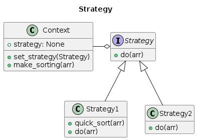
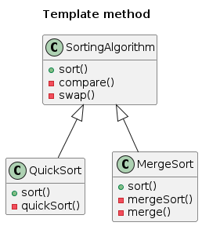

# Практическая работа №3

### Стратегия
Это поведенческий шаблон, призванный для обеспечения взаимозаменяемости разных алгоритмов или вариаций алгоритма с одинаковыми интерфейсами.

1. Создаем интерфейс Strategy с методом do(), который будет реализован в классах-стратегиях.
2. Создаем два класса-стратегии: Strategy1 и Strategy2, которые будут реализовывать различные алгоритмы сортировки.
3. Создаем класс Context, который будет использовать выбранную стратегию для выполнения операции над массивом.
4. В метод setStrategy() передается объект одного из классов-стратегий.
5. Метод make() вызывает метод do() у текущей стратегии и выполняет операцию над массивом.

### Шаблонный метод
Это поведенческий шаблон проектирования, определяющий основу алгоритма и позволяющий наследникам переопределять некоторые шаги алгоритма, не изменяя его структуру в целом

SortingAlgorithm является абстрактным базовым классом, определяющим общую структуру и поведение алгоритмов сортировки. Классы QuickSort и MergeSort наследуются от SortingAlgorithm и реализуют свои конкретные методы sort() для сортировки массива с помощью соответствующих алгоритмов.

В методах sort() каждого конкретного подкласса класса SortingAlgorithm определены методы quick_sort_helper() и merge_sort_helper(), соответственно, которые вызываются рекурсивно для выполнения сортировки. В этих методах реализованы соответствующие алгоритмы сортировки.

Метод partition() класса QuickSort реализует процедуру разбиения массива на две части, которые будут рекурсивно сортироваться, и возвращает индекс опорного элемента. Метод sort() класса MergeSort использует рекурсивный алгоритм сортировки слиянием, разделяя входной массив на две части до тех пор, пока каждая из них не будет состоять из одного элемента, и затем объединяет их.

