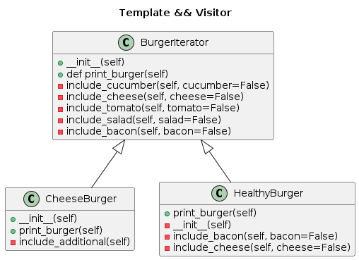

# Практическая работа №4
###  Итератор (Iterator)
— это поведенческий паттерн проектирования, который даёт возможность последовательно обходить элементы составных объектов, не раскрывая их внутреннего представления.

### Посетитель (Visitor)
— это поведенческий паттерн проектирования, который позволяет добавлять в программу новые операции, не изменяя классы объектов, над которыми эти операции могут выполняться.

[Пример кода](burger_building.ipynb)
